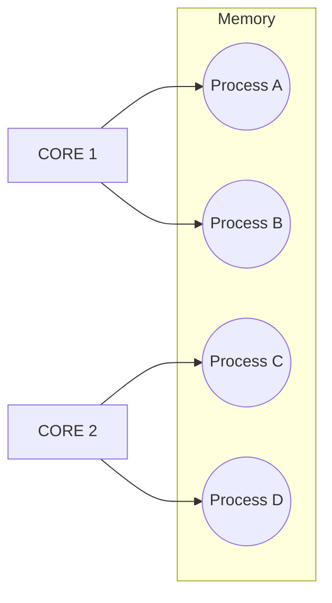

# L05 Limited Direct Execution

> In order to virtualize the CPU, the operating system needs to somehow
> share the physical CPU among many jobs running seemingly at the same
> time. The basic idea is simple: run one process for a little while,
> then run another one, and so forth. By time sharing the CPU in this
> manner, virtualization is achieved.
-- OSTEP

:::note

**THE CRUX: HOW TO EFFICIENTLY VIRTUALIZE THE CPU WITH CONTROL**

The OS must virtualize the CPU in an efficient manner while retaining
control over the system. To do so, both hardware and operating-system
support will be required. The OS will often use a judicious bit of
hardware support in order to accomplish its work effectively.

:::

In the context of processes and operating systems, limited direct
execution (LDE) plays a critical role in ensuring the security and
stability of the system. One of the primary ways LDE is implemented is
through the concept of time sharing, where the CPU core is divided up
into time slices that are allocated to different processes.

In a multi-tasking operating system, multiple processes are running
simultaneously on the same CPU core. To prevent one process from
executing malicious code that could compromise the stability of the
entire system, LDE is used to limit the types of instructions that
user programs can execute. This helps ensure that each process
operates within its own memory space and does not interfere with other
processes running on the system.



When a process is given a time slice to run on the CPU core, it can
only execute a limited set of instructions that have been pre-approved
by the operating system. These instructions are carefully designed to
ensure that the process does not attempt to access memory that does
not belong to it, or execute any other instructions that could
potentially cause harm to the system.

The concept of context switching is also important in the context of
LDE. When a process has completed its time slice on the CPU core, the
operating system must switch to a new process, which requires a
context switch. During the context switch, the operating system saves
the current state of the process being switched out, and restores the
state of the new process being switched in. This ensures that each
process runs in a secure and stable environment, and that they cannot
interfere with one another.

Overall, LDE is a crucial component of modern operating systems,
allowing multiple processes to run simultaneously on a single CPU core
without compromising system stability or security. By limiting the
types of instructions that user programs can execute, and carefully
managing context switches, LDE enables the time sharing of CPU
resources and ensures that all processes run in a safe and secure
environment.

## Reading

- [Chapter 6 Mechanism: Limited Direct Executioni](https://pages.cs.wisc.edu/~remzi/OSTEP/cpu-mechanisms.pdf).

You may find it helpful to clone the book's [code repository](https://github.com/remzi-arpacidusseau/ostep-code). This will allow you to quickly review the code associated with each chapter.

```bash
git clone https://github.com/remzi-arpacidusseau/ostep-code.git
```

## Slides

import { PowerPoint } from '@site/src/components/PowerPoint'

<PowerPoint lec_src={require('./05-limited-direct.pptx').default}/>

## C/C++ Resources

Some useful resources in case you are a little rusty.

- [The C Programming Language, 2nd Edition](pathname:///resources/the-c-programming-language.pdf)
- [Essential C](pathname:///resources/essential-c.pdf)
- [The C Book](https://publications.gbdirect.co.uk//c_book)
- [A Tour of C++, 2nd Edition](pathname:///resources/a-tour-of-c++-2nd.pdf)

## Additional Resources

- [GDB Basics (VSCode)](https://youtu.be/u6iXfpBDU3w). This is a video tutorial on how to use GDB inside of a VSCode terminal. This doesn't integrate with the VSCode debugger system, but it is helpful.
