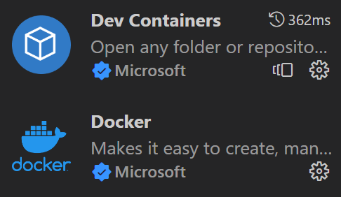

# Setup Docker

Docker is an alternative to be used in place of edlab. We built an image that creates the same environment as edlab in a container that you can run on your own machine. 

## Known Issue

- Mac with Apple Silicon cannot use gdb for debugging code inside the container. However it works fine for coding, compiling, and running.

## Setup 

1. Download and install Docker Desktop

    [Docker Website](https://www.docker.com/products/docker-desktop/) 

    For windows users, I recommended you to select the option 'use WSL2 instead of Hypervisor`. If you don't have WSL2 setup, follow the instruction from [Microsoft](https://learn.microsoft.com/en-us/windows/wsl/install). 


2. Choose a directory that you want to keep every files you will work on.
For example, I will put everything under `/home`

3. Save the following file to the directory
[docker-compose.yml](docker-compose.yml)

    The file structure will be like this. 
    ```
    └── /home
        ├── project 1 
        └── docker-compose.yml
    ```
4. In your terminal, `cd` into the directory and run

    `docker compose up -d`

5. Visual Studio Code Setup
    
    You need to install the following plugins for your vsc

    - Docker
        
    - Dev Containers

    


## Update the docker image

In some case, we may have an update to the image, and you need to run the following command to updaye your local container:

```
cd /path/to/directory 
docker-compose pull
docker-compose up -d
```
